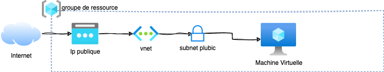
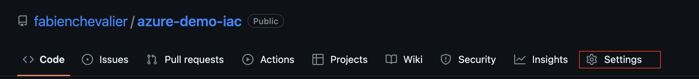
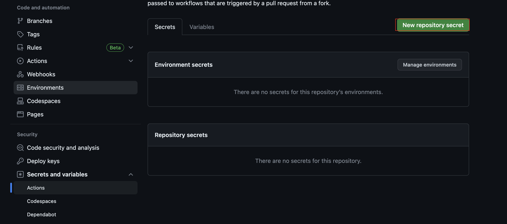
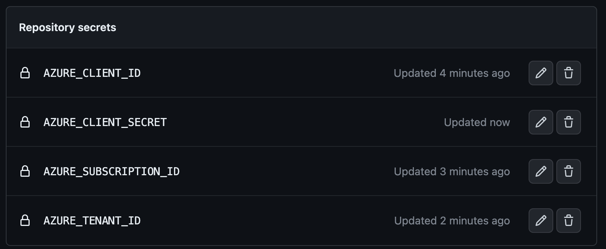

# Un peu de contexte

Dans le cadre d'un projet pro réalisé lors de mes études, j'ai décidé de monter une petite infrastructure permettant
d'héberger une simple page web sur une machine virtuelle NGINX. Le but étant de présenter les avantages et le
fonctionnement d'une infra managée as code et les différents outils mis en oeuvres dans sa réalisation. Bien sûr, il
m'aurais été bien plus simple d'utiliser la 
[fonctionnalité d'Azure Files](https://learn.microsoft.com/en-us/azure/storage/blobs/storage-blob-static-website) 
permettant de servir cette page automatiquement, mais ce n'était ici pas le but recherché. En effet, le but était de
proposer une maquette me permettant de détailler le fonctionnement d'une pipeline CI/CD et d'orchestrer la
création puis le déploiement d'une image de serveur web intégrant les middlewares nécessaires à l'affichage de cette même
page web. C'est donc pour moi l'occasion de rédiger un article assez complet détaillant pas mal de technologies que je
cottoie quotidiennement dans le cadre de mon alternance. Ainsi, il sera question ici de découvrir :

- Le fonctionnement d'une pipeline de déploiement (CI/CD) à travers GitHub Actions
- La création d'images de machines virtuelles avec Packer
- La gestion des middlewares avec Ansible
- Le provisionnement d'une infrastructure cloud simple avec Terraform

Je t'invites à jeter un oeil à mon article sur le 
[déploiement d'une instance GLPI sur le cloud Azure](https://fchevalier.net/blog/informatique/azure-appservices-terraform/)
avant de poursuivre car la suite de cet article part du principe que tu es déjà familiarisé avec Azure et Terraform. En
effet, il est question ici d'automatiser une partie des opérations décrites dans mon précédent article.

L'ensemble des configurations décrites ici sont disponible sur ce repo [GitHub](https://github.com/fabienchevalier/azure-demo-iac)


Cet article est assez dense, mais j'ai fais de mon mieux pour qu'il soit digeste. N'hésites pas à utiliser la section commentaire si certains points ne te semblent pas clair.


## Infrastructure cible



L'infrastructure cible est plutôt basique : il s'agit d'une VM situé dans un subnet public accessible depuis le web
sur les ports 80/443. Cette VM hébergera un serveur NGINX qui permettera de servir notre webpage statique.

## Organisation du lab

Je te propose de soit crééer ton propre repo vierge sur GitHub, ou de cloner de le mien et dérouler l'article :

```bash
git clone https://github.com/fabienchevalier/azure-demo-iac.git
```


## Identification au compte Azure

Le but du projet étant d'automatiser le déploiement via CI/CD, il va falloir trouver un moyen de nous identifier au 
compte Azure qui servira à déployer la VM. 
[Azure propose deux types d'identifications](https://learn.microsoft.com/en-us/azure/developer/github/connect-from-azure?tabs=azure-cli%2Clinux):

- Connexion via un compte de service (service principal)
- Connexion via OIDC

La connexion via un compte de service nécessite de stocker un token dans un secret GitHub, ce qui
est considéré comme moins sécurisé. Cependant dans le cadre de cet article j'ai choisi d'utiliser cette méthode car plus
simple à mettre en place. En production, on préferera utiliser une connexion via token OIDC.

### Création du compte de service principal (Azure AD Application)

[La documentation Microsoft](https://learn.microsoft.com/en-us/azure/developer/github/connect-from-azure?tabs=azure-cli%2Clinux#use-the-azure-login-action-with-a-service-principal-secret)
décrit de façon claire les étapes à effectuer :

```bash
az ad sp create-for-rbac --name "GitHub_maleo-iac" --role contributor \
                                --scopes /subscriptions/{subscription-id}/resourceGroups/{resource-group} \
                                --sdk-auth
```

Je nomme ici mon application `GitHub_maleo-iac` en référence à mon projet d'école, mais tu peux utiliser un autre nom


L'output de la commande devrais te retourner un JSON de ce type : 

```bash
{
    "clientId": "<GUID>",
    "clientSecret": "<GUID>",
    "subscriptionId": "<GUID>",
    "tenantId": "<GUID>",
    (...)
}
```

Note les `clientId`, `clientSecret`, et `subscriptionId`, il faudra les renseigner dans le GitHub secret par la suite.

### Création des GitHub Secrets

Les secrets GitHub permettent de stocker des informations de façon cryptée, récupérables par le `workflow` à l'execution. 

Pour créer un secret GitHub Action se rendre dans la page settings : 



Puis sur la page `Actions` de la catégorie `Secrets and variables`, rentrer les 4 secrets avec les infos récupérées dans
l'output de la commande précédente :






Respecte bien le nom des secrets donné dans la capture d'écran. Ils seront réutilsés dans la CI par la suite.


## Introduction à Packer


Packer est un outil open source développé par HashiCorp qui permet de créer des images de machines virtuelles (VM) 
préconfigurées et réutilisables pour différents environnements de déploiement. Les fichiers de configuration sont écris
dans un language spécifique à l'outil, développé par Hashicop : `HCL`. La syntaxe est relativement aisée à comprendre
et se rapproche beaucoup de celle utilisée par Terraform. Très concrètement, la création d'une image se fait en 
plusieurs étapes : 

- On identifie une image source qui sera utilisée en tant que modèle (par exemple une image Ubuntu Server vierge)
- On modifie cette image en y déployant les logiciels et fichiers nécessaires
- On déploye cette image nouvellement créée

### Structure de notre repo

Avant de détailler la configuration de notre image avec Packer, voici un exemple de structure permettant d'organiser 
nos ressources sur le repository : 

```
├── README.md
├── ansible
│      ├── files
│      │      └── index.html
│      └── maleo-webserver-image-base.yml
└── packer.pkr.hcl
```

Le fichier `packer.pkr.hcl` contiendra l'ensemble des configurations nécessaires à la customisation de l'image. Pour 
le déploiement des middlewares nécessaires, on passera par un playbook Ansible qui sera détaillé plus bas. Je t'invites
à reproduire l'arborescence ci-dessus avant de passer à la suite.

### Variables et syntaxe

La déclaration de variable permettera à Packer de s'authentifier sur ton compte Azure via l'application créée en début 
d'article:

```hcl
# variable declaration
variable "client_id" {
  type    = string
  default = env("AZURE_CLIENT_ID")
}

variable "client_secret" {
  type    = string
  default = env("AZURE_CLIENT_SECRET")
}

variable "subscription_id" {
  default = env("AZURE_SUBSCRIPTION_ID")
}

variable "tenant_id" {
  type    = string
  default = env("AZURE_TENANT_ID")
}
```

La partie `default = env("VARIABLE")` permet de récupérer les données depuis les variables d'environnement du runner 
lancé par la CI. Pas d'inquiétude, je détaille cela plus tard.


