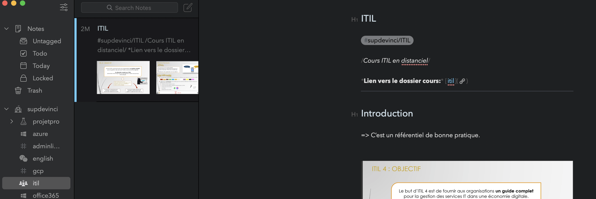

## Le language Markdown


**Attention** Cet article part du principe que vous êtes déjà à l'aise avec la rédaction en Markdown. Si ce n'est pas le cas, un tutorial interactif assez bien fait est disponible [ici](https://www.markdowntutorial.com/)


Markdown est un language de balisage facile à utiliser et à lire. Je m'en suis beaucoup servi lors de mes études pour prendre des notes, car Markdown permet d'obtenir un résultat propre très rapidement avec un simple éditeur de texte. Différents logiciels sont compatible avec Markdown, permettant d'organiser ses notes et d'obtenir un aperçu en temps réel lors de l'édition. Personnellement, j'utilise [Bear](https://bear.app/) sous MacOS:



> Markdown est aussi extrêmement répandu dans le monde de l'informatique, la majorité des fichiers `README` étant rédigé en utilisant la syntaxe Markdown.

## Les limites du Markdown

J'ai tellement pris l'habitude de rédiger mes documentations et notes en Markdown, que ça soit sur VS Code ou sur des applications type Bear, que l'utilisation de Word me paraît désormais extrêmement lourde et contre-productive. Le souci, c'est que par défaut, **Markdown n'est pas prévu pour générer des documents imprimables**. En effet, c'est uniquement un language de balisage, conçu pour être interprété et affiché à l'écran.

## Générer un document type "Mémoire" depuis des fichiers Markdown

Je me suis basé sur [ce repo ](https://github.com/tompollard/phd_thesis_markdown) pour créer un template (en Français) permettant de générer un document adapté à mes rendus d'école. Concrètement, il s'agit ici d'utiliser [Pandoc](https://pandoc.org/) associé à un template LaTeX permettant de générer le document. Rassurez-vous, il n'est pas nécessaire d'apprendre LaTeX pour utiliser ce projet, seule certaines commandes suffisent.

### Étape 1

Récupérer [sur mon GitHub](https://github.com/fabienchevalier/phd_thesis_markdown) le template :

``` bash
git clone https://github.com/fabienchevalier/phd_thesis_markdown.git
```

Pandoc nécessite LaTeX pour générer des PDF. En fonction de votre OS, il faut donc installer une distribution LaTeX:

- Linux: `sudo apt-get install textlive`
- Windows: voir du côté de [MiKTex](https://miktex.org/)
- MacOS: via homebrew avec `brew install --cask mactex`

Par la suite, mettre à jour sa distribution LaTeX:

```bash
sudo tlmgr update --self
```

### Étape 2

Installer Pandoc dans un environnement Python séparé. Personnellement, j'utilise `miniconda` sous MacOS (disponible aussi sur Linux/Windows):

```bash
brew install miniconda #apt-get install miniconda devrais fonctionner sous Ubuntu/Debian
conda create -n phd -y python=3.7 pandoc
conda activate phd
```

Les autres dépendances peuvent être installées automatiquement via le Makefile proposé :

```bash
make install
```

### Étape 3

Par la suite, déposer les fichiers `md` dans le dossier `source` et executer `make pdf` pour générer le document au format PDF. Ne pas oublier de modifier le fichier `metadata.yml` dans le dossier source en fonction des besoins! Un exemple de rendu est disponible [ici](https://github.com/fabienchevalier/phd_thesis_markdown/raw/main/output/thesis.pdf).