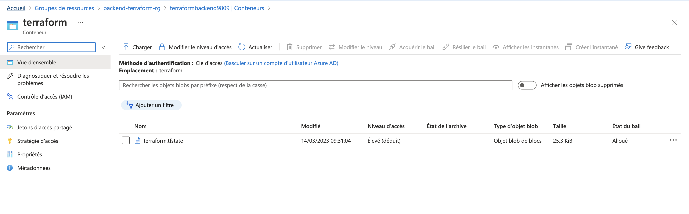
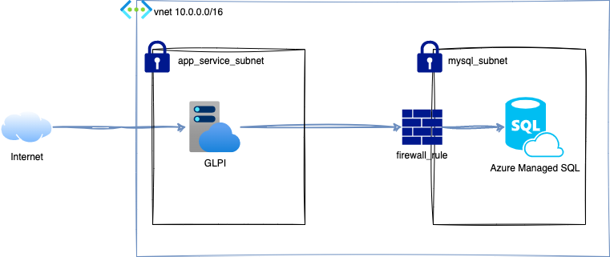
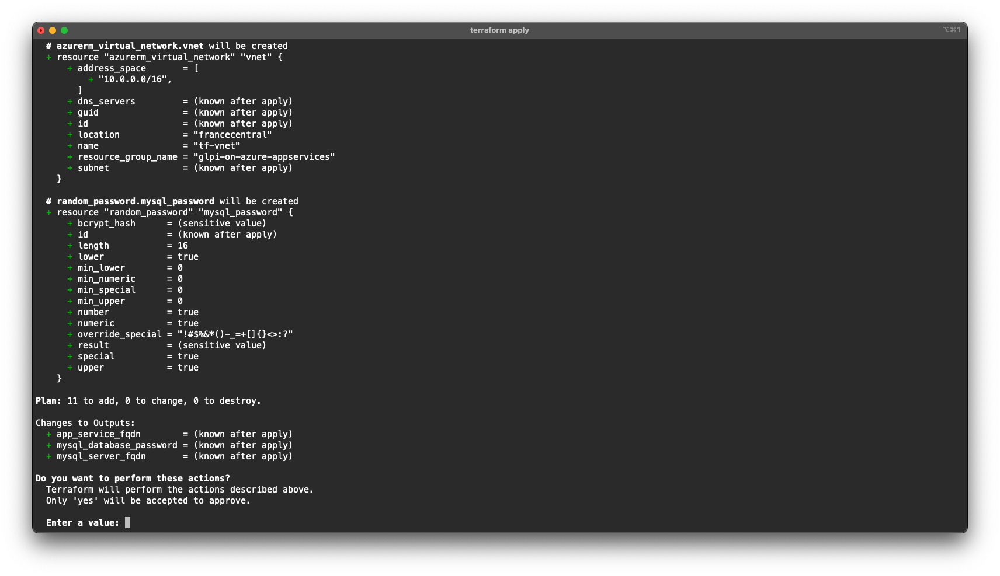
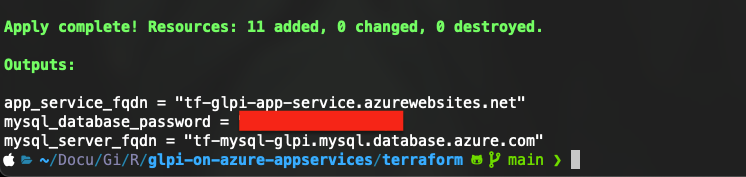
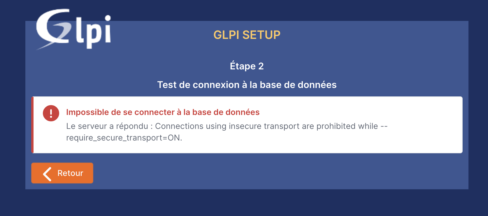
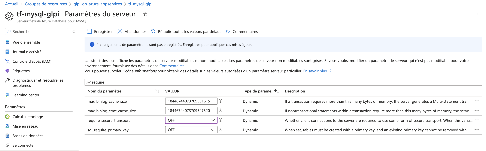
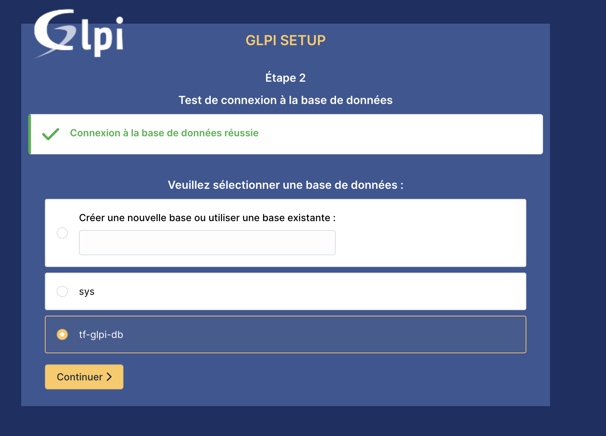
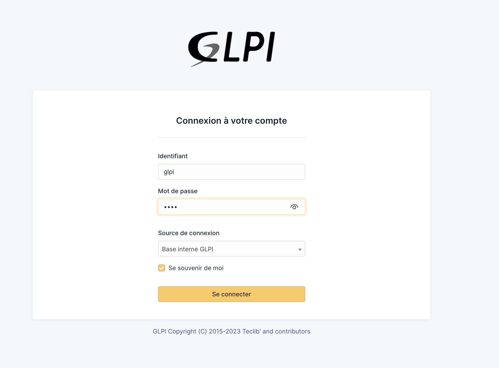

## Prérequis

- Un compte Azure (ici j'utilise mon compte Azure Student)
- Terraform
- AzureCLI
- Un compte de stockage Azure, avec un containeur permettant de stocker le `terraform.tfstate`

Dans mon cas, j'ai créé un groupe de ressource dédié à mon backend via le portail Azure, puis le compte de stockage dans ce groupe :

[](imgs/capture_potail_azure.png)

Ci ce n'est pas déjà fait, il faut vous authentifier à Azure via la commande `az login` et suivre les instructions.

## Objectif

L'objectif de cet article est d'expliquer la mise en place d'une instance GLPI dans le cloud Azure, et de sa base de donnée MySQL en utilisant des services managés proposés par Microsoft. L'intégralité du code est disponible [ce repo ](https://github.com/fabienchevalier/glpi-on-azure-appservices). Cet article est basé sur le déploiement de GLPI, mais devrais fonctionner avec n'importe quelle application web fonctionnant avec une base de donnée MySQL.

## Infrastructure cible

Pour déployer notre instance de test, nous allons (dans l'ordre) définir :

- Un groupe de ressource Azure qui va contenir l'ensemble des ressources
- Un VPC (Virtual Network sur Azure)
- 2 subnets : un dédié à la base de données, l'autre à l'application web.
- Un serveur managé Azure mysql flexible (plan Bs1)
- Une base de donnée managée Azure SQL
- Un plan App Service Linux (B1)
- Une App Service Linux
- Une règle de pare-feu autorisant les instances Azure à accéder à la base de donnée.

La base de donnée ne sera pas accessible via le web, mais uniquement via notre VPC. En fin de compte, l'architecture devrais ressembler à ceci :



## Terraform

### Structure

Notre code Terraform se décompose en 3 fichiers :

```
├── inputs.tf
├── main.tf
└── outputs.tf
```

- `inputs.tf`définit les variables d'entrées (adressage, nom des ressources etc). [inputs.tf ](https://github.com/fabienchevalier/glpi-on-azure-appservices/blob/main/terraform/inputs.tf)
- `outputs.tf`permet d'afficher les données nécessaires pour se connecter à notre app une fois le déploiement terminé. [outputs.tf ](https://github.com/fabienchevalier/glpi-on-azure-appservices/blob/main/terraform/outputs.tf)
- `main.tf` contient l'ensemble du code provisionnant l'infrastructure. Je vais le détailler ci-dessous.

### Configuration du backend

Au début du fichier `main.tf`, je configure le provider Terraform [azurerm](https://registry.terraform.io/providers/hashicorp/azurerm/latest/docs), en lui indiquant où stocker le fichier `terraform.state`permettant de garder en mémoire la configuration de l'infrastructure :

```terraform
terraform {
    backend "azurerm" {
        resource_group_name  = "backend-terraform-rg"
        storage_account_name = "terraformbackend9809"
        container_name       = "terraform"
        key                  = "terraform.tfstate"
    }

    required_providers {
        azurerm = {
            source = "hashicorp/azurerm"
            version = "~> 3.47.0"
    }
}

    required_version = ">= 1.4.0"
}

provider "azurerm" {
    features {}
}
```

### Création du groupe de ressource

Pour créer des ressources dans Azure, il faut créer un groupe de ressources :

```terraform
# Resource Group
resource "azurerm_resource_group" "rg" {
    name     = var.resource_group_name
    location = var.location
}
```

**A noter:** le code reprends les variables définies dans le fichier `inputs.tf`. Il en va de même pour les exemples suivants.


### Création du VPC et des sous-réseaux

L'exemple de code ci-dessous crée un VPC, et deux sous réseaux. Un pour la base de donnée, et un pour l'application web :

```terraform
# Virtual Network and subnet
resource "azurerm_virtual_network" "vnet" {
    name                = var.vnet_name
    address_space       = var.vnet_address_space
    location            = var.location
    resource_group_name = azurerm_resource_group.rg.name
}

resource "azurerm_subnet" "mysql_subnet" {
    name                 = var.mysql_subnet_name
    resource_group_name  = azurerm_resource_group.rg.name
    virtual_network_name = azurerm_virtual_network.vnet.name
    address_prefixes     = var.mysql_subnet_address_prefixes
    service_endpoints    = ["Microsoft.Sql"]

    delegation {
        name = "vnet-delegation"

    service_delegation {
        name    = "Microsoft.DBforMySQL/flexibleServers"
        actions = [
            "Microsoft.Network/virtualNetworks/subnets/action"
            ]
        }
    }
}

resource "azurerm_subnet" "app_service_subnet" {
    name                 = var.app_subnet_name
    resource_group_name  = azurerm_resource_group.rg.name
    virtual_network_name = azurerm_virtual_network.vnet.name
    address_prefixes     = var.app_subnet_address_prefixes

    delegation {
    name = "vnet-delegation"

    service_delegation {
        name    = "Microsoft.Web/serverFarms"
        actions = ["Microsoft.Network/virtualNetworks/subnets/action"]
        }
    }
}
```

Les délégations configurées dans les blocs `delegation`et `service_delegation`permettent de designer ces subnets en tant que cibles pour des ressources PaaS Azure.


### Serveur de base de donnée SQL

J'ai choisi de déployer une base de donnée de type `flexible`, en utilisant le plan `B_Standard_B1s`. C'est suffisant pour notre infrastructure, et peu onéreux. Le tableau des tarifs est [disponible ici](https://azure.microsoft.com/fr-fr/pricing/details/mysql/flexible-server/).

```terraform
resource "azurerm_mysql_flexible_server" "mysql" {
    name                = var.mysql_server_name
    location            = azurerm_resource_group.rg.location
    resource_group_name = azurerm_resource_group.rg.name

    administrator_login    = var.mysql_database_admin_username
    administrator_password = random_password.mysql_password.result

    backup_retention_days  = 5
    sku_name            = "B_Standard_B1s"

    delegated_subnet_id = azurerm_subnet.mysql_subnet.id
}
```

Le mot de passe administrateur est généré aléatoirement et sera affiché dans les output après avoir déployé l'infrastructure. L'option' `delegated_subnet_id` permet d'attacher ce serveur au subnet précédement créé.

### Base de donnée SQL

```terraform
# MySQL Database
resource "azurerm_mysql_flexible_database" "mysql" {
    name                = var.mysql_database_name
    resource_group_name = azurerm_resource_group.rg.name
    server_name         = azurerm_mysql_flexible_server.mysql.name
    charset             = "utf8"
    collation           = "utf8_unicode_ci"
}
```

Cet extrait de code crée une base de donnée dédiée à GLPI, sur le serveur MySQL managé Azure.

### Règles de firewall

```terraform
# Firewall rule
resource "azurerm_mysql_flexible_server_firewall_rule" "fw-mysql" {
    name                = "AllowAzureIPs"
    resource_group_name = azurerm_resource_group.rg.name
    server_name         = azurerm_mysql_flexible_server.mysql.name
    start_ip_address    = "0.0.0.0"
    end_ip_address      = "0.0.0.0"
}
```

Par convention, autoriser les ips `0.0.0.0`revient à autoriser les ressources Azure uniquement d'accéder à la base de donnée.

### Plan Azure App Service et application App Service

```terraform
resource "azurerm_service_plan" "glpi-service-plan" {
    name                = var.glpi_app_service_plan_name
    resource_group_name = azurerm_resource_group.rg.name
    location            = azurerm_resource_group.rg.location
    os_type             = "Linux"
    sku_name            = "B1"
}

resource "azurerm_linux_web_app" "glpi-app-service" {
    name                = var.glpi_app_service_name
    resource_group_name = azurerm_resource_group.rg.name
    location            = azurerm_service_plan.glpi-service-plan.location
    service_plan_id     = azurerm_service_plan.glpi-service-plan.id

    site_config {
        always_on           = false
        application_stack {
            docker_image     = "diouxx/glpi"
            docker_image_tag = "latest"
        }
    }
}

#Connect the Azure App to subnet
resource "azurerm_app_service_virtual_network_swift_connection" "app" {
    app_service_id = azurerm_linux_web_app.glpi-app-service.id
    subnet_id      = azurerm_subnet.app_service_subnet.id
}
```

Cet extrait de code déploye l'application web GLPI au sein d'un plan `B1`. Dans mon exemple, j'utilise une image docker GLPI hébergée sur le [docker hub](https://hub.docker.com/r/diouxx/glpi). 


Le plan B1 est le plan App Service le moins cher permettant d'attacher un App Service à un subnet, et ainsi pouvoir communiquer en interne avec la base de donnée.


## Déploiement de l'infrastructure

Une fois le code rédigé ([ou téléchargé directement depuis mon repo ](https://github.com/fabienchevalier/glpi-on-azure-appservices)), le déploiement s'effectue en 3 commandes :

```bash
terraform init
terraform plan
terraform apply
```

`terraform init` permet de configurer le backend et récupérer le module `azurerm`. La commande plan permet de passer en revue les changements apportés à l'infrastructure, et apply de la déployer :

[](imgs/capture_terraform_apply.png)

Si tout se passe bien, la sortie de la commande apply vous donnera le nécessaire pour configurer votre app GLPI :

[](imgs/capture_apply.png)


Le déploiement peut prendre du temps, notamment la base de donnée MySQL (+/- 10 minutes dans mon cas). L'App Service peut aussi mettre un certain temps avant d'être accessible depuis l'adresse, le temps que l'image docker soit déployée.


## Dernières étapes de configuration

Dans l'interface d'installation de GLPI, saisir les informations données dans l'output terraform. Si vous avez utilisé mon fichier `input.tf`, l'utilisateur SQL sera `glpi`. La première tentative de connexion donnera cette erreur :

[](imgs/capture_glpi.png)

Pour la corriger, il suffit de se rendre dans les paramètres de la BDD sur le portail Azure, et de passer le paramètre `require_secure_transport`sur `OFF`:

[](imgs/capture_erreur.png)

Il est normalement désormais possible d'installer GLPI sur la base de donnée créée pour l'occasion à l'aide de Terraform:

[](imgs/capture-glpi-setup.png)

## Vérifications

Une fois l'application installée, on se connecte à l'aide des identifiants par défaut (glpi/glpi):

[](imgs/capture-glpi-login.png)

C'est fonctionnel!


En raison de la faible puissance de la base de donnée managée choisie, l'affichage peut être très long dans l'application. Si c'est inutilisable, ne pas hésiter à augmenter la taille de l'instance SQL.


## Suppression de l'infrastructure

Un simple `terraform destroy`détruira l'ensemble des ressources crées. A ne pas oublier, le coût mensuel de l'App Service peut être élevé.