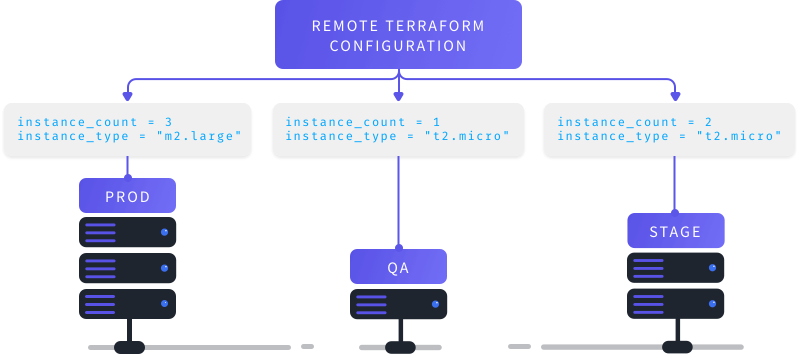
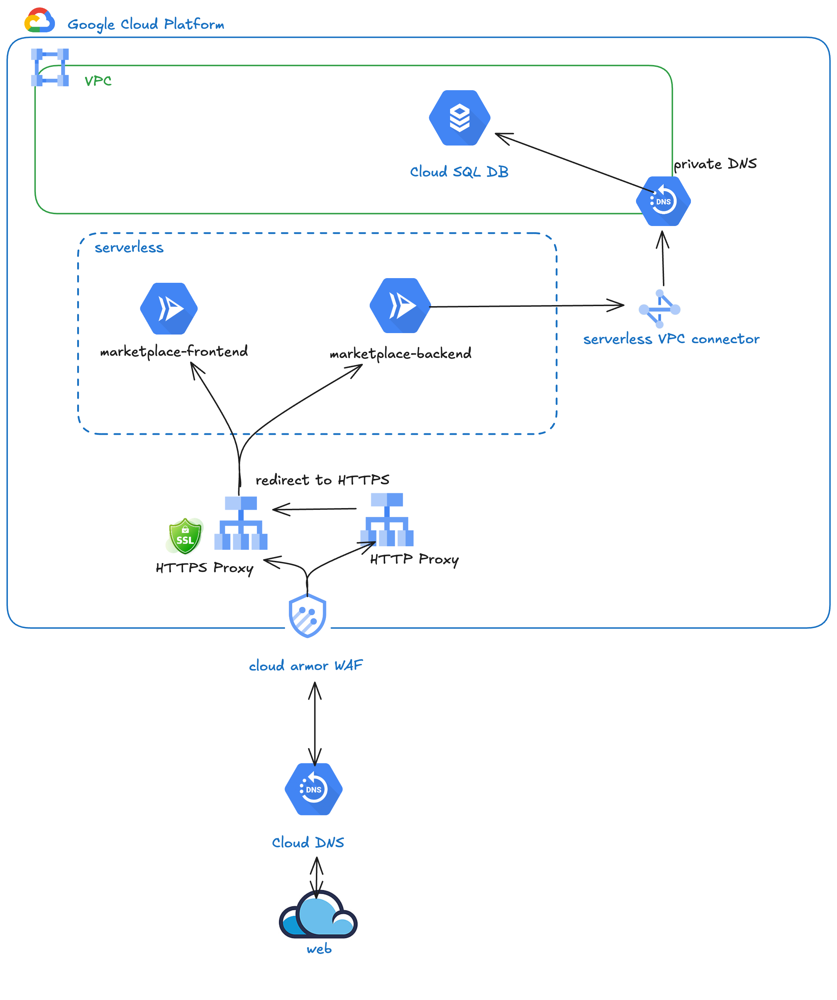


Nouvel article!



Terragrunt est un wrapper (surcouche) pour Terraform, conçue pour simplifier et optimiser la gestion des configurations d'infrastructure en suivant le principe DRY (Don't Repeat Yourself). Dans cet article, je vais tenter d'expliquer le fonctionnement de Terragrunt à travers un cas client fictif.


## Introduction

Reprenant les bonnes pratiques issues du monde du développement, Terragrunt permet de réduire la duplication de code en factorisant les configurations Terraform. Cet article à pour but d'expliquer la mise en place d'un projet Terraform avec Terragrunt, et surtout de comprendre là où Terragrunt apporte de la valeur par rapport à Terraform seul. Attention, Terragrunt nécessite des bases **solides** en configurations Terraform, cet article se destine donc à un public ayant déjà pratiqué Terraform sur des infrastructures moyennes à grandes, et souhaitant en optimiser la gestion afin de passer à l'échelle. Si ce n'est pas ton cas, je t'invite à consulter [cette section](https://blog.stephane-robert.info/docs/infra-as-code/provisionnement/terraform/introduction/) du blog de Stéphane Robert pour te familiariser avec Terraform. Tout y est très bien expliqué.

## Contexte

J'ai été amené à travailler pour un client ayant une infrastructure cloud conséquente, et logiquement beaucoup de ressources à gérer. La principale problématique rencontrée dans la gestion d'une architecture de cette taille avec Terraform est pour moi l'organisation même du code, et la dette technique qui en découle. En effet, à force de multiplier les ressources, variables, environnements etc.. , on peut vite se retrouver avec du code difficile à comprendre et maintenir, surtout lors de phases de build avec des deadlines serrées.

Terragrunt se veut être une réponse efficace à ces problématiques en apportant une organisation **claire** et **modulaire** au code Terraform. En externalisant les paramètres spécifiques à chaque environnement et en automatisant la gestion des dépendances entre modules, Terragrunt offre une solution structurée pour minimiser la dette technique.


Cependant, son adoption n'est pas forcément pertinente pour des projets de petite taille, et peut même être contre-productive si mal utilisée *(👋 [Kubernetes](https://www.appvia.io/blog/5-reasons-you-should-not-use-kubernetes))*. De plus, la courbe d'apprentissage peut être assez raide, j'en ai fais les frais.

Comprendre les concepts de modularité, d’héritage de configurations ou encore de gestion des dépendances demande un investissement initial non négligeable. Cela dit, une fois compris et bien utilisé, Terragrunt peut vite se révéler indispensable. Il permet de structurer efficacement des projets complexes, et de réduire la duplication de code (factorisation) de manière élégante.

Dans cet article, je vais donc tenter de t'expliquer comment démarrer un projet en me basant sur l'expérience que j'ai pu acquérir sur des infrastructures de grosses tailles.

Les exemples que je vais fournir se basent sur des configurations GCP, mais la logique est applicable à n'importe quel cloud provider. Il ne s'agira pas ici d'expliquer comment bootstrap tel ou tel ressources, mais plutôt de te montrer comment organiser ton code Terraform avec Terragrunt.

## C'est quoi concrètement, Terragrunt



Terragrunt est avant-tout un outil `CLI`, reprenant la syntaxe de Terraform dans son fonctionnement ad-hoc. On retrouvera donc les fameux `terragrunt plan`, `terragrunt apply`, etc.. Là où ça devient intéressant, c'est que Terragrunt propose en sus des fonctionnalités comme la génération dynamiques de fichiers `backend.tf` (oui, il permet aussi de créer le `bucket` à la volée si celui-ci n'existe pas), des [fonctions](https://terragrunt.gruntwork.io/docs/reference/built-in-functions/) permettant de manipuler des fichiers `HCL` (comme `read_terragrunt_config`), ou encore une gestion avancée des dépendances entre modules. Mais trêve de bavardages, la meilleure façon de comprendre Terragrunt est d'étudier un exemple concret.

## L'organisation du code

L'organisation du code, ainsi que l'architecture des dossiers sont **extrêmement** importante. Encore une fois, l'usage de Terragrunt permet de forcer des bonnes pratiques, mais un mauvais choix d'organisation peut vite se révéler cauchemardesque, en particulier avec Terragrunt. Pour cet article, je vais donc choisir de baser mes explications sur le cas d'un client fictif, mais qui se rapproche de ce que j'ai pu voir dans le monde réel.

### Contexte client

Partons du principe suivant : je souhaite héberger pour le compte d'un client une application [3 tiers](https://fr.wikipedia.org/wiki/Architecture_trois_tiers) classique, afin d'héberger une marketplace. Niveau ressources cloud, on aura donc besoin de :


Je travaille beaucoup sur GCP en ce moment, pour simplifier la rédaction de mon article, je me base donc sur des assets GCP.


- Configurer un réseau VPC (subneting, firewall rules, etc..).
- Mettre en place une base de données
- Déployer une application web (front + back), dans mon example containérisée
- Mettre en place un load balancer et un orchestrateur de conteneurs, par facilitée je vais ici utiliser CloudRun.

On parle d'IaC, il va donc falloir créer et organiser son code via des repos Git. Les développeurs vont travailler sur leurs repos respectifs, à savoir `marketplace-frontend` et `marketplace-backend`. En parallèle, il va falloir créer un repo appelé `marketplace-infrastructure` permettant de définir l'infrastructure permettant d'héberger l'application (base de données, load balancer, etc..). Enfin, un repo `infrastructure-shared-modules` sera créé afin de gérer et versionner nos modules. Je ne vais pas m'attarder sur les questions de CI/CD et autres, ce n'est pas le sujet ici.


J'ai volontairement simplifié l'architecture pour l'exemple, en omettant toute la configuration IAM, Landing Zone et autres. Ici, je me focus uniquement sur la configuration Terragrunt.


### Schéma d'architecture

Schématiquement, on se retrouve avec quelque chose de classique :



D'un premier abord, dans le cas où mon client fictif ne souhaite utiliser que deux environnements de développement, pour ce projet unique, Terragrunt serais overkill. Imaginons maintenant que ce même client souhaite 4 environnements, à savoir `dev`, `staging`, `preprod` et `prod`. De plus, il viens de recevoir une demande du métier, nécessitant la mise en place de 6 applications similaires. Tu vois ou je veux en venir ?

### Hiérarchie des dossiers


La logique d'organisation des dossiers est directement inspirée de l'excellent [repo maintenu par Padok](https://github.com/padok-team/docs-terraform-guidelines/tree/main), fournissant des bonnes pratiques sur l'utilisation de Terraform, et notamment le concept de `layers`. Je t'invites à le consulter.


Je sais donc que je dois livrer la marketplace en premier lieu, sur 4 environnements, mais avec en tête le fait que quelques semaines plus tard la demande évoluera. Là, on rentre dans un cas ou Terragrunt pourra m'être utile, car je vais pouvoir **factoriser** dès le début. Commençons d'abord par l'arborescence type des dossiers dans mon repo d'infrastructure :

```plaintext
└── layers
    ├── certificates
    │   ├── dev
    │   ├── staging
    │   ├── preprod
    │   ├── prod
    ├── cloud-armor
    │   ├── web-backend
    │   │   ├── dev
    │   │   ├── staging
    │   │   ├── preprod
    │   │   ├── prod
    ├── cloud-run
    │   ├── marketplace-frontend  
    |   |   ├── dev  
    |   |   ├── staging  
    |   |   ├── preprod  
    |   |   └── prod  
    |   ├── marketplace-backend  
    |        ├── dev  
    |        ├── staging  
    |        ├── preprod  
    |        └── prod  
    ├── sql-database
    │   ├── dev
    │   ├── staging
    │   ├── preprod
    │   └── prod
    ├── secrets
    │   ├── dev
    │   ├── staging
    │   ├── preprod
    │   └── prod
    └── load-balancer
        ├── dev
        ├── staging
        ├── preprod
        └── prod
```


Il manque quelques briques comme la gestion DNS, VPC et autres, mais je ne vais pas m'attarder là-dessus. Je vais me concentrer sur la partie Terragrunt.


Au sein du dossier `layers`  on se retrouve donc avec un dossier par type d'asset. Au sein de chaque dossier, on va retrouver un dossier par environnement. Jusqu'ici, c'est classique, on pourrais d'ailleurs utiliser cette logique avec du Terraform vanilla. Attardons nous maintenant sur le contenu de ces dossiers.

### Fichiers de configurations Terragrunt

Au sein du dossier `layers`, à la racine, je vais créer deux fichiers : `common.hcl`, ainsi que `root.hcl`.

#### `common.hcl`

Ce fichier aura pour but de définir les `locals`, c'est à dire les variables communes à l'ensemble de mes environnements. On y retrouvera donc l'`id` du projet, la region, et autres. Sans plus de suspense, le voici :

```hcl
# common.hcl
locals {
  root_dir    = get_parent_terragrunt_dir()
  layers_path = "${local.root_dir}/../layers"
  environment = basename(get_original_terragrunt_dir())
  region      = "europe-west3"
  config      = lookup(local.config_by_environment, local.environment, {})
  config_by_environment = {
    dev = {                            
      project_id = "marketplace-dev"
      network    = "marketplace"
    },
    staging = {                            
      project_id = "marketplace-staging" 
      network    = "marketplace"              
    },
    preprod = {
      project_id = "marketplace-preprod"
      network    = "marketplace"
    },
    prod = {                            
      project_id = "marketplace-prod" 
      network    = "marketplace"              
    }
  }
}

inputs = {}
```


Dans le cas ou l'on souhaite utiliser un Cloud Provider different, comme `AWS` par exemple, il faudra adapter la configuration des `locals` en fonction de la logique de nommage de ton provider. Par exemple, pour AWS, il faudra adapter le `region` et le `project_id` en fonction de la logique de nommage AWS (`account_id` par exemple au lieu du `project_id`).


Le fichier `common.hcl` va donc nous permettre de centraliser la configuration de l'ensemble de nos environnements. On y retrouve donc la configuration de chaque environnement, ainsi que le `project_id` et le `region`. On y retrouve aussi une variable `inputs`, qui va nous permettre de définir des variables d'entrées communes à l'ensemble des modules.


Point important : cet example de configuration pars du principe qu'un VPC dédié est créé en amont pour héberger l'ensemble des ressources.


Détaillons un peu ce fichier :

- `root_dir` : cette ligne utilise la fonction `get_parent_terragrunt_dir()` pour obtenir le chemin du répertoire parent du fichier Terragrunt actuel. Cela permet de définir dynamiquement le chemin racine du projet, utile pour structurer les fichiers et modules

- `layers_path`: cette ligne construit le chemin vers le dossier `layers` en utilisant la variable `root_dir`. Cela permet de référencer les couches ou modules Terraform situés dans un dossier spécifique (layers) adjacent au répertoire racine.

- `environnement`: cette ligne utilise la fonction `basename()` pour extraire le nom du répertoire où se trouve le fichier Terragrunt actuel. Dans notre cas, cela permet de determiner dynamiquement l'environnement (par exemple, dev, staging, etc.) en fonction du nom du dossier contenant ce fichier.

- `config`: un peu plus complexe. Cette ligne utilise la fonction `lookup()` pour rechercher une configuration spécifique à l'environnement actuel (local.environment) dans la variable `config_by_environment` expliquée ci-dessous. Si une configuration pour l'environnement actuel existe, elle sera récupérée ; sinon, une valeur par défaut (ici `{}`) sera utilisée. C'est une manière assez habile d'adapter automatiquement les configurations en fonction de l'environnement actuel sans avoir à `hardcoder` des conditions.

- `config_by_environment`: ce bloc définit un objet contenant les configurations spécifiques à chaque environnement (par exemple, dev, staging, etc.). Ici, je l'utilise pour spécifier de manière globale le `project_id` et le `network` pour chaque environnement. On pourrais y ajouter d'autres configurations que l'on souhaite centraliser tel que des `tags` etc.


Les fonctions Terragrunt sont très puissantes. Elles permettent de rendre le code `HCL` idempotent. 


Pas de panique, je détaillerais plus clairement la manière dont cela fonctionne dans les parties suivantes. Pour l'instant, retiens juste que ce fichier `common.hcl` va nous permettre de centraliser les variables communes à l'ensemble de nos environnements.

#### `root.hcl`

De la même manière que le fichier `common.hcl`, le fichier `root.hcl` va nous permettre de centraliser certaines configurations. Garde en tête que le nommage de ces fichiers est purement arbitraire, mais reflète selon moi bien leur usage.

```hcl
# root.hcl
locals {
  # On récupère la configuration commune définie dans common.hcl
  common = read_terragrunt_config(find_in_parent_folders("common.hcl")).locals
  config = local.common.config
}

remote_state {
  backend = "gcs"
  config = {
    bucket   = "${local.config.project_id}-tfstates"
    project  = local.config.project_id
    prefix   = "tfstate/${path_relative_to_include()}"
    location = local.common.region
  }
  generate = {
    path      = "backend.tf"
    if_exists = "skip"
  }
}
```

Ici, et c'est une des fonctionnalités que j'apprécie particulièrement, on va pouvoir définir la configuration du `backend` de manière centralisée. En effet, Terragrunt va se charger de générer le fichier `backend.tf` pour nous dans chaque `layers`.


On va donc se retrouver avec un fichier `state` par environnement, et par module. Par exemple, pour le module `cloud-run`, on va se retrouver avec un fichier `tfstate` dans le bucket `marketplace-dev-tfstates` (pour l'environnement dev), avec le prefix `tfstate/cloud-run/marketplace-frontend`.


### Configuration d'un `layer`

Pour le moment donc, j'ai couvert la configuration `racine`, permettant de factoriser à la base de l'arborescence. Comme dit plus haut, c'est de cette manière que Terragrunt permet de construire une infrastructure en mode `DRY`. Descendons maintenant d'un cran dans l'arborescence, et voyons comment configurer un asset `cloud-run` par exemple.

#### Gestion des modules Terraform de façon DRY

Naviguons dans le dossier `layers/cloud-run/`. Son contenu sera le suivant :

```plaintext
└── cloud-run
    ├── dev
    │   ├── inputs.hcl
    │   └── terragrunt.hcl
    ├── module.hcl
    ├── preprod
    │   ├── inputs.hcl
    │   └── terragrunt.hcl
    ├── prod
    │   ├── inputs.hcl
    │   └── terragrunt.hcl
    └── staging
        ├── inputs.hcl
        └── terragrunt.hcl
```

Commençons par le contenu du fichier `module.hcl`. Rappelles toi, j'ai indiqué en intro qu'il était nécessaire de créer un repo `infrastructure-shared-modules` pour y stocker mes modules. C'est ici que je vais les référencer :

```hcl
# module.hcl
terraform {
  source = "git@github.com:my-org/infrastructure-shared-modules.git//modules/cloudrun?ref=cloudrun-v1.0.0"
}
```

Concrètement, mon repo `infrastructure-shared-modules` va contenir l'ensemble de mes modules, versionnés via `git`.


Je te conseilles vivement de `tag` tes modules, afin de pouvoir revenir en arrière si besoin. En effet, si tu fais évoluer un module, et que tu ne tag pas ta version, tu risques d'appliquer les changements à l'ensemble des configurations.


En backstage, Terragrunt va cloner ce `repo`, et lui fournir les `inputs` définies dans chaque fichiers `inputs.hcl`. On retrouvera d'ailleurs un dossier `.terragrunt-cache`, contenant le repo cloné dans chaque environnement.

#### Que se passe-t-il lorsque je lance un `terragrunt apply` ?

Un petit coup d'oeil sur le fichier `terragrunt.hcl` permet de se rendre compte de toute la logique expliquée précédemment :

```hcl
include "root" {
  path           = find_in_parent_folders("root.hcl")
  merge_strategy = "deep"
}

include "common" {
  path           = find_in_parent_folders("common.hcl")
  merge_strategy = "deep"
}

include "module" {
  path           = find_in_parent_folders("module.hcl")
  merge_strategy = "deep"
}

include "inputs" {
  path           = "inputs.hcl"
  merge_strategy = "deep"
}
```

Ce qui se résume schématiquement :


flowchart TD
    A[Configuration finale] --> B[root.hcl]
    A --> C[common.hcl]
    A --> D[module.hcl]
    A --> E[inputs.hcl]


Terragrunt parcourra depuis le dossier courant, et remontera dans l'arborescence jusqu'à trouver les fichiers `root.hcl`, `common.hcl`, `module.hcl` et `inputs.hcl`. Il va ensuite fusionner le contenu de ces fichiers, en appliquant la stratégie de fusion définie dans chaque `include`. Dans notre cas, on a choisi la stratégie `deep`, qui va permettre de fusionner les objets imbriqués. La [documentation de Terragrunt](https://terragrunt.gruntwork.io/docs/reference/config-blocks-and-attributes/#include) permettra d'en savoir plus sur les différentes stratégies de fusion, et le fonctionnement d'include en général.


Pour faire simple, on peut partir du principe que Terragrunt va fusionner les fichiers de configuration en un seul fichier, en appliquant la stratégie de fusion définie dans chaque `include`. Il va ensuite appliquer cette configuration au module Terraform. Le fichier `input.hcl` contiendra donc l'équivalent d'un fichier `variables.tf` dans un module Terraform classique. Il va permettre de définir les variables d'entrées pour le module, et sera fusionné avec les autres fichiers de configuration.


#### Le concept de `terragrunt run-all

Cette commande va permettre d'appliquer l'ensemble des configurations de manière récursive. Par exemple, si je me trouve dans le dossier `layers/, et que je lance la commande suivante :

```bash
terragrunt run-all apply .
```


## Pour conclure

Je t'avais prévenu, la courbe d'apprentissage est assez raide. Mais concrètement, la difficulté se situe vraiment dans la compréhension de la logique de `merge` de Terragrunt. Pour maintenir une infrastructure `DRY`, Terragrunt utilise des fonctions et des `includes` pour fusionner les fichiers de configuration à l'`apply`.

Tu l'as bien compris, la mise en place d'une architecture `DRY` avec Terragrunt reste relativement complexe de part l'abstraction qu'elle propose. Selon moi, la valeur ajoutée vaut le coup si :

- Ton projet possède de nombreux environnements à gérer (dev, staging, prod, etc..).
- Tu dois gérer un grand nombre d'applications/infrastructures identiques, mais dont la configuration diffère par environnement.
- Tu souhaites gérer des modules Terraform de manière centralisée, et versionnée, et les appliquer à l'ensemble de tes environnements.

