## Introduction

Le cloud-gaming se démocratise de plus en plus notamment par le biais d'acteurs tel que OVH avec son offre Shadow, ou encore NVDIA avec GeForce Now. Je me suis toujours demandé par quel procédé il serais possible de créer mon propre serveur cloud dédié au jeu, et surtout si c'était viable. Après quelques recherches, j'ai découvert quelques pistes assez intéressantes, notament du côté d'AWS qui propose des instances de calcul avec GPU plutôt abordables : [les instances G4](https://aws.amazon.com/fr/ec2/instance-types/g4/).


Attention à la facture si tu oublies d'éteindre ou de supprimer ton instance après avoir déroulé l'article!


Cet article te permettra de monter ta propre VM GPU, tout en te faisant découvrir `aws cli` et CloudFormation, l'outil d'IAC proposé par AWS.

### Les types d'instances G4

AWS propose deux architectures, l'une est basée sur les puces GPU NVIDIA T4 (`g4dn`), l'autre sur des puces AMD Radeon Pro V520 (`g4ad`). Ci-dessous un tableau comparatif du rapport prix/performances des différentes instances : 

| Instance Type | 3DMark Score | On-demand Price (us-east-1, USD, 02/23) | Price-performance (3DMark points / $) |
|--------------|--------------|-----------------------------------------|---------------------------------------|
| g4dn.xlarge  | 4300         | $0.71                                   | 6056                                  |
| g4dn.2xlarge | 4800         | $1.12                                   | 4286                                  |
| g4dn.4xlarge | 6000         | $1.94                                   | 3093                                  |
| g4ad.xlarge  | 5100         | $0.56                                   | 9107                                  |
| g4ad.2xlarge | 6600         | $0.91                                   | 7253                                  |
| g4ad.4xlarge | 7600         | $1.60                                   | 4750                                  |
| g5.xlarge    | 6800         | $1.19                                   | 5714                                  |
| g5.2xlarge   | 10200        | $1.58                                   | 6456                                  |
| g5.4xlarge   | 13000        | $2.36                                   | 5508                                  |

*Source : [https://github.com/aws-samples/cloud-gaming-on-ec2-instances](https://github.com/aws-samples/cloud-gaming-on-ec2-instances)*

Pour cet article, je me base sur une instance AMD `g4ad.xlarge`, largement suffisante pour mes besoins.

### Prérequis

- Un compte AWS
- `awscli` d'installé et de configuré ([voir la doc AWS](https://docs.aws.amazon.com/fr_fr/cli/latest/userguide/getting-started-install.html))
- Assez de quota sur ton compte AWS pour provisionner des instances GPU G4 (j'explique plus bas comment en obtenir)


**A noter:** Il n'y a pas de `free tier` proposé par AWS sur les instances GPU. Il est essentiel de bien éteindre ou détruire ta VM une fois la session terminée afin éviter d'être facturé pour des heures inutilisées...


### Infrastructure cible

Mon template CloudFormation permet de générer :

- Un VPC dédié
- Un subnet public
- Une instance EC2 `g4adn.xlarge` avec le système sur un disque SSD, avec un volume HDD (`st1`) monté pour stocker les jeux

Je me suis basé sur l'ami [Microsoft Windows Server 2019 with AMD Radeon Pro Driver](https://aws.amazon.com/marketplace/server/procurement?productId=23b09675-aabe-40fb-b359-4848ac279440) proposée gratuitement par AWS pour générer mon template. Elle est préconfigurée avec les drivers AMD préinstallés (pratique).


Les disques `st1` sont relativement lents, mais peu cher. J'ai choisi cette option ici afin de tester ma config, mais il est conseillé d'utiliser un stockage SSD pour jouer confortablement.


## Déploiement

### Quotas de services

Les instances G4 AWS nécessitent des quotas pour être provisionnées. Par défaut, sur ce type d'instance, le quota est de 0. Si tu essayes de provisionner une machine G4 en ayant 0 quota, ça ne marchera pas. Pour ce faire, connecte toi à la console AWS et tape `service quotas` dans la barre de recherche et choisi EC2 : 

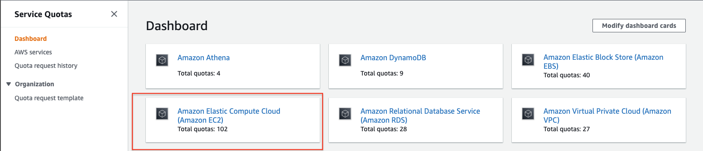

Dans la barre de recherche sur l'écran suivant, tape "G4" et suit les instructions pour augmenter le quota. Le quota correspond au nombres de vCPU allouées à une instance. Pour la `g4ad.xlarge`, il nous faut 4 vCPU. Changer la valeur du quota par 4, et envoyer.

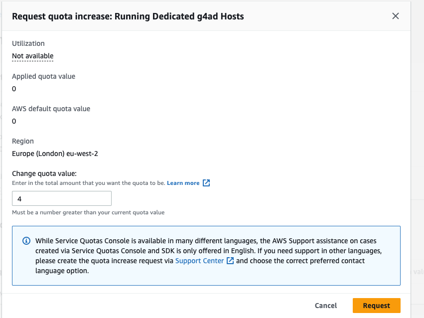


Il n'est pas possible d'obtenir des quotas pour des host `dedicated` avec un compte AWS personnel qui a peu servi. Après avoir fait la demande, le service client d'AWS la refusera, et te proposera des quotas pour des instances de type `spot` ou `on-demand`. J'ai demandé d'avoir accès aux instances `on-demand` suite à ma première requête, celles-ci furent disponible le lendemain.


### Déploiement de l'EC2

Si ce n'est pas déjà fais, authentifie toi à `awscli`. Si tu as besoin d'aide, [la doc d'Amazon est vraiment bien faite](https://docs.aws.amazon.com/cli/latest/userguide/cli-chap-configure.html).


Étant sous MacOS, les commandes suivantes devraient fonctionner sous Linux et MacOS. Si tu es sous Windows, je te conseille [de passer via WSL](https://learn.microsoft.com/fr-fr/windows/wsl/install) pour bénéficier d'un shell bash.


Mon template utilise une KeyPair appelée `CloudGamingKeyPair` permettant de decrypter le mot de passe administrateur de l'instance. Pour la créer : 

```bash
mkdir ~/.ssh/aws-private-keys && cd ~/.ssh/aws-private-keys
aws ec2 create-key-pair \
  --key-name CloudGamingKeyPair \
  --query 'KeyMaterial' \
  --region eu-west-2 \
  --output text > CloudGamingKeyPair.pem
```

Clone mon repo et ce rendre dans le dossier contenant le template :

```bash
git clone https://github.com/fabienchevalier/ec2-cloudgaming && cd cloudformation
```

Ouvre le template avec un editeur de texte, et modifie les lignes 60 et 64 en remplacant l'adresse par ton adresse IP.

```yaml
      SecurityGroupIngress:
        - IpProtocol: tcp
          FromPort: 8443 #NICE DVC Server
          ToPort: 8443
          CidrIp: 0.0.0.0/0 #Replace that with your IP address (mask should be /32)
        - IpProtocol: tcp
          FromPort: 3389
          ToPort: 3389
          CidrIp: 0.0.0.0/0 #Repl
```

 `0.0.0.0/0` autorise n'importe quelle adresse sur le port RDP et NICE DCV Server, ce qui n'est pas souhaitable.


**Tip:** tu peux récupérer ton adresse ip public via `curl ifconfig.me`


Déploie le template CloudFormation :

```bash
aws --region eu-west-2 cloudformation deploy \
  --template deploy-cloud-gaming-ec2.cfn.yaml \
  --stack-name CloudGamingStack
```


Il est possible de suivre l'avancement de la création de la stack sur la console AWS, via la page CloudFormation : 


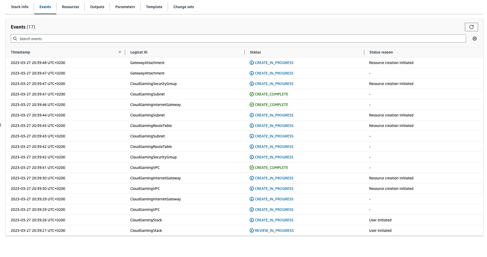

Une fois l'instance déployée, il faut récupérer le mot de passe Administrateur permettant une première connexion via le protocole RDP.

On récupère l'ID de l'instance crée : 

```bash
aws --region eu-west-2 ec2 describe-instances \
  --filters "Name=tag:Name,Values=CloudGamingInstance" \
  --query 'Reservations[].Instances[].[InstanceId]' \
  --output text
```

Copier l'ID généré puis : 

```bash
aws ec2 get-password-data --instance-id  i-1234567890abcdef0 \
  --priv-launch-key ~/.ssh/aws-private-keys/CloudGamingKeyPair.pem
```

Le mot de passe Administrateur se situe dans le champ `PasswordData` de l'output, par exemple :

```json
{
    "InstanceId": "i-1234567890abcdef0",
    "Timestamp": "2013-08-30T23:18:05.000Z",z
    "PasswordData": "&ViJ652e*u"
}
```

On y est presque!

### Configuration de l'instance

#### Disque dur

Une première connexion via RDP est nécessaire afin de configurer quelques derniers détails. Pour ce faire, lance un client RDP (Microsoft Remote Desktop sous MacOS pour ma part) et connecte toi à l'instance via son IP publique.

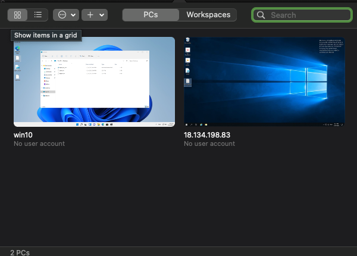


Utilise les informations de login récupérées auparavant (login `Administrator`, mot de passe donné par la commande `ec2 get-password-data`) pour te connecter.


Cherches `disk manager` dans la barre de recherche Windows, et formate le disque créé par le template CloudFormation comme ceci : 

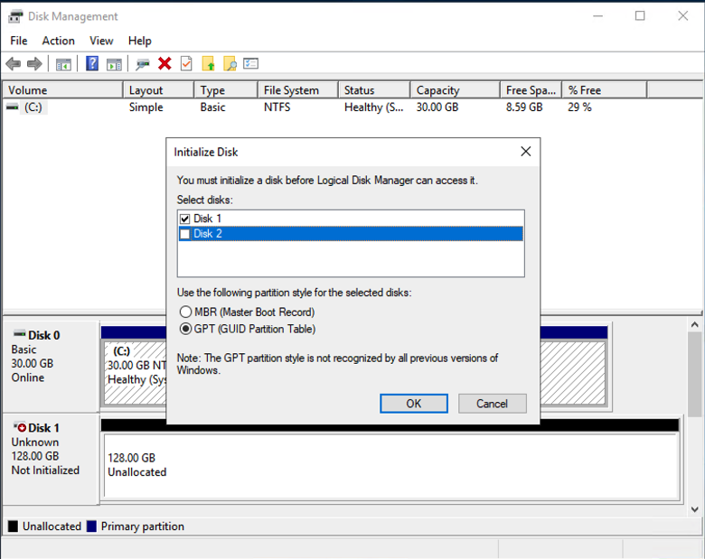

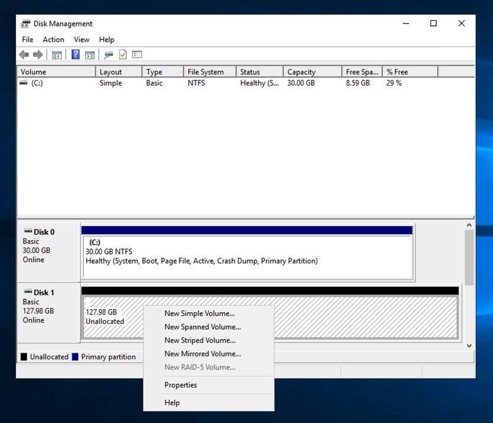

Choisir l'option `New Simple Volume`, et formater l'ensemble de l'espace disque disponible.

#### Serveur Nice DCV

Il nous reste à déployer le serveur Nice DCV permettant de streamer sans latences depuis l'instance EC2. Pour ce faire, il faudra se connecter une première fois en RDP via l'adresse IP publique de l'EC2 afin d'executer ce script PowerShell :

```powershell
# Set TLS 1.2 for Invoke-RestMethod
[Net.ServicePointManager]::SecurityProtocol = [Net.SecurityProtocolType]::Tls12
# Set the download link to Nice DCV Server (64-bit installer)
$downloadUrl = "https://d1uj6qtbmh3dt5.cloudfront.net/nice-dcv-server-x64-Release.msi"
# Set the path for our download, which will be in the temp directory
$installerFile = "nice-dcv-server-x64-Release.msi"
$installerDownloadPath = (Join-Path $env:TEMP $installerFile)
# Set the default owner to the current user
$installerOwner = [Environment]::UserName
# Set Install Command Expression
$msiExpression = "msiexec.exe /i $installerDownloadPath AUTOMATIC_SESSION_OWNER=$installerOwner ADDLOCAL=ALL /quiet /norestart /l*v dcv_install_msi.log"
# Download the file
Invoke-Webrequest $downloadUrl -UseBasicParsing -OutFile $installerDownloadPath
# Install
Invoke-Expression $msiExpression
```

Pour ce faire, copie/colle ce script dans le notepad de l'instance, et enregistre le fichier sur le bureau :

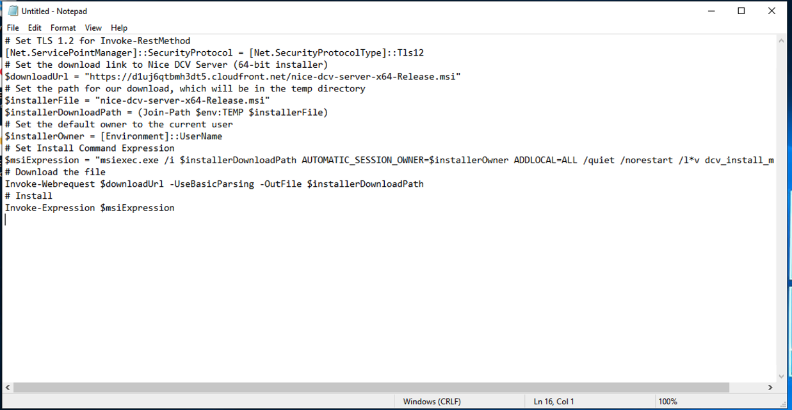

Puis, clic droit sur l'icône, puis `Run with PowerShell`. Attendre une ou deux minutes après que la fenêtre se ferme, le temps que le serveur se lance.

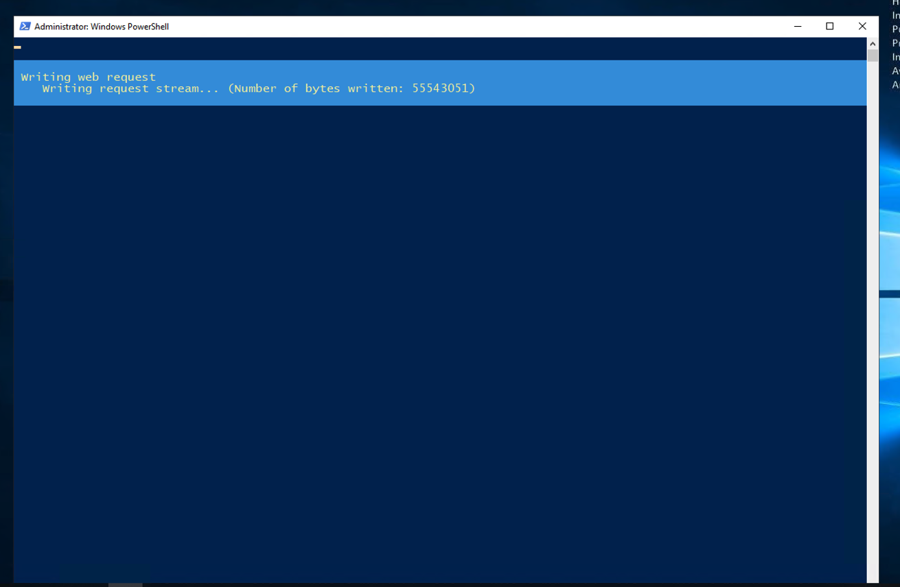

That's it! Une fois le serveur déployé, tu peux fermer ta connexion RDP, et [télécharger le client Nice DCV](https://download.nice-dcv.com/).

#### Connexion à l'instance via Nice DCV

Lance le client, et connecte toi via l'adresse IP publique de ton instance, sur le port `8443`:

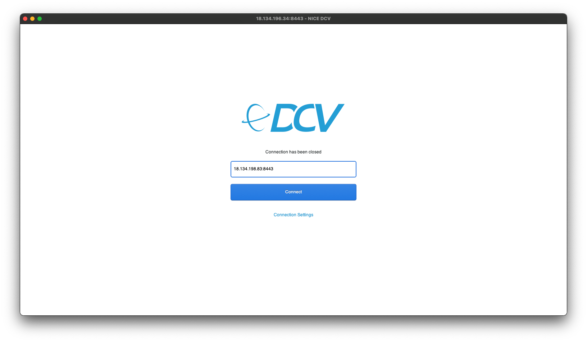

Une erreur de certificat peut apparaître, clique sur `Trust & Connect`

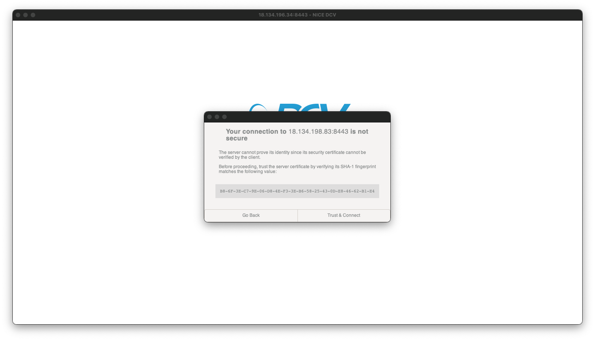

A partir de là, libre à toi d'installer tes jeux et de commencer à jouer !


Je te conseilles de désactiver [le mode de sécurité d'IE](https://serverspace.io/support/help/disable-enhanced-security-windows-server/), navigateur par défaut sur Windows Server (hé oui...) puis d'installer un navigateur récent.


#### Quelques améliorations

Par défaut, le serveur NICE DCV streame 25 FPS. C'est configurable via le registre Windows, via la clée située ici : `HKEY_CURRENT_USER\Software\GSettings\com\nicesoftware\dcv`. Créer une nouvelle clée `display` et lui donner pour valeur (type `DWORD 32bits`) le nombre de FPS souhaité.

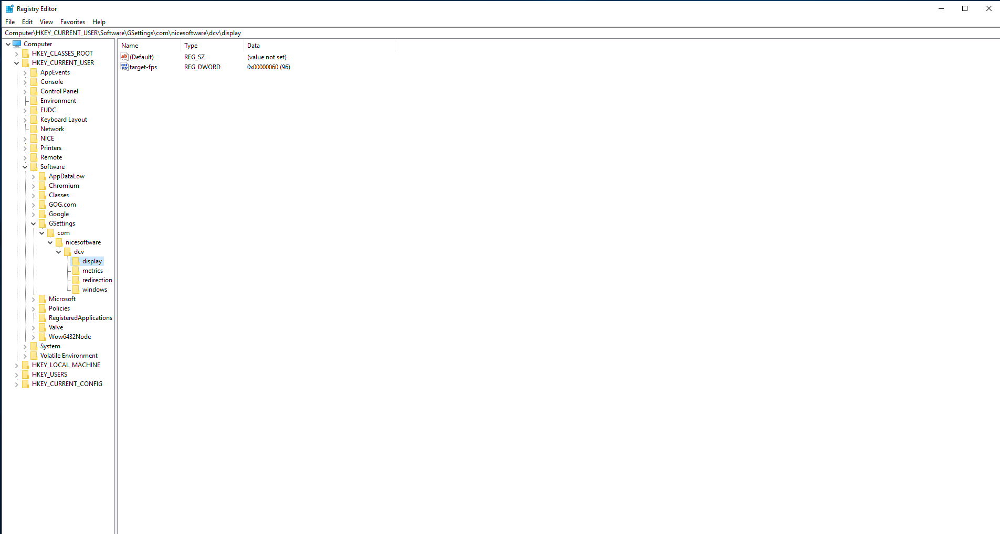

## Conclusion

Après quelques heures d'essais, le confort de jeu est plutôt bon. Pas trop de latences, même en WiFi. La qualité d'image est aussi plutôt bonne.

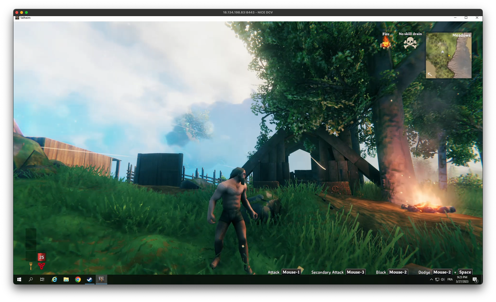

Cependant, le coût engendré par l'utilisation de l'EC2 reste trop élevé à mon sens pour que cela soit viable. En effet, il faut ajouter au prix horaire de l'instance :

- Le stockage (assez cher si on choisit de passer par du SSD : +/- 11$/mois)
- La bande passante : payée au Go, ça peut vite s'envoler pour du stream 4K@60FPS.

Cela dit, cette méthode de tarification à l'heure peut convenir à des joueurs occasionels ne voulant pas s'abonner à un service qu'ils utiliserons que très peu.


Il est aussi possible d'utiliser Parsec pour streamer le contenu du serveur, mais dans sa version gratuite la résolution maximale est de 1080p.


*Si tu remarques des fautes ou quelque chose qui ne fonctionne pas, n'hésites pas à le mentionner dans les commentaires !*

A bientôt !