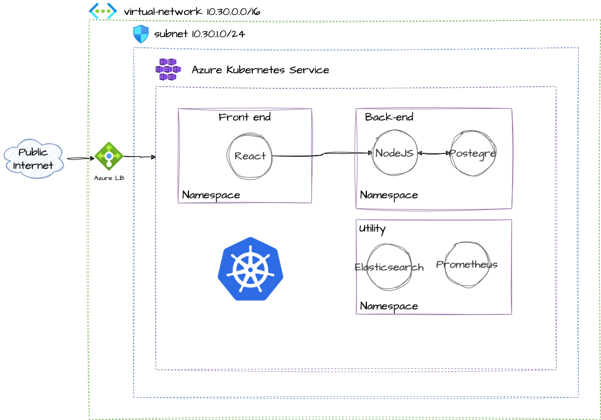


Réalisé dans le cadre de mon année de Bachelor, le Hackaton à pour but de proposer une solution informatique en une 
semaine. Un jury juge ensuite la solution la plus convaincante et désigne les vainqueurs.

L'ensemble du projet que j'ai réalisé est disponible en open-source  
[sur GitLab](https://gitlab.com/sdv-open-course-factory)



## Introduction

Lors de ce hackathon, mon équipe à choisi pour sujet `Solution Libre`. Il s'agissait de :

- développer le frontend d'une application à destination de formateurs et de leurs élèves
- développer l'architecture qui permettra in fine d'héberger l'application, son backend et sa base de données
- proposer une CI/CD permettant de mettre en place une livraison et une intégration continue de l'applicatif et son infrastructure

Le back-end étant fourni par l'école, mon travail ici se limitait à son intégration ainsi qu'a celle du front-end.

### Contexte et travail d'équipe

L'ensemble des étudiants de l'école sont réunis en équipe de 10, tout niveaux et spécialités confondues. Toute la 
difficulté étant de coordonner l'ensemble de l'équipe afin de livrer un produit fonctionnel. 

### Limites et difficultés

Malheureusement, l'équipe dont j'ai fais partie n'as pas sû délivrer un front-end dans les temps impartis. Cela dit,
de mon côté j'ai pu architecturer l'ensemble de l'infrastructure ainsi que la pipeline CI/CD et obtenir un POC 
fonctionnel. Il ne me manquais plus qu'un front-end afin d'obtenir le résultat demandé, dommage :disappointed_relieved:!

Cependant, j'ai pu tester le fonctionnement du back-end sur l'architecture ainsi déployée. **C'est d'ailleurs l'objet de
cet article** : présenter ma solution sur la partie DevOps :sunglasses:. 

## Schéma d'architecture

J'ai réalisé un petit brouillon de l'architecture que j'ai souhaité mettre en place sur le cloud Azure : 



On à donc:

- Un cluster Kubernetes managé sur le cloud Azure (AKS)
- 3 namepsaces : un pour le front, un pour le back et le dernier pour le monitoring et la gestion des logs


Lors de la réalisation, j'ai regroupé tout mes `pods` K8S au sein du même `namespace` par manque de temps lors du 
développement de la partie Terraform. La partie monitoring est aussi inachevée et ne figure pas sur le repo. Cela dit,
il n'est pas exclu que je m'y penche dans le cadre d'un article de blog dans un futur proche.


En l'état, l'architecture disponible sur le lien GitLab donné en préambule permet uniquement de requêter l'API du
backend. De plus, comme indiqué sur le schéma la base de donnée utilisée est hébergée dans un `pod`. J'aurais préféré
mettre en place une base de donnée managée mais n'étant pas encore très à l'aise avec Kubernetes sur Azure, j'ai préféré
aller au plus simple. Le but de cet article reste pour moi l'occasion de garder une sorte de documentation sur le projet
réalisé. **A ne pas utiliser en production donc** :wink:.

### Infrastructure As Code

#### Contexte

L'enjeu étant de provisioner tout cela as code, j'ai déployé cette architecture avec Terraform. Le repo contenant
l'infrastructure est construit comme ceci:

```
└── terraform
    ├── aks.tf
    ├── environment
    │   └── dev
    │       └── variables.tfvars
    ├── kubernetes.tf
    ├── main.tf
    ├── modules
    │   └── kubernetes
    │       ├── main.tf
    │       ├── outputs.tf
    │       └── variables.tf
    ├── outputs.tf
    ├── rg.tf
    ├── variables.tf
    └── vpc.tf
```

Cette architecture est dès le départ conçue pour être en mesure de déployer des environments `ISO` dev/pprd/prod.
Cela permet au développeur d'être en mesure (en théorie) de tester son code en amont sur des architectures identiques
avant de déployer l'applicatif en production.

#### Backend et providers

Dans le fichier `main.tf`, en début de code on retrouve la déclaration du `backend`, ainsi que les `providers` requis:

```terraform
terraform {
  backend "azurerm" {
    resource_group_name  = "backend-terraform-rg"
    storage_account_name = "backendhackatonsdv"
    container_name       = "terraform-state"
    key                  = "terraform.tfstate"
  }

  required_providers {
    azurerm = {
      source  = "hashicorp/azurerm"
      version = "3.63.0"
    }
    kubernetes = {
      source  = "hashicorp/kubernetes"
      version = "2.21.1"
    }
  }
}

provider "azurerm" {
  features {}
  skip_provider_registration = true
}

provider "kubernetes" {
  host                   = module.aks.host
  client_certificate     = base64decode(module.aks.client_certificate)
  client_key             = base64decode(module.aks.client_key)
  cluster_ca_certificate = base64decode(module.aks.cluster_ca_certificate)
}

```

Le `backend`, permettant de stocker le fichier `tfstate` consiste en un compte de stockage Azure hébergeant ce même
fichier. Dans le cas de ce lab, j'ai utilisé un compte de stockage préalablement existant sur mon compte Azure.

J'utilise les providers `azure_rm` et `kubernetes` permettant de respectivement :

- intéragir avec mon compte Azure
- intéragir avec le cluster Kubernetes déployé


J'utilise un compte Azure Students fourni par l'école pour ce lab. Terraform refusais 
systématiquement d'`apply` mon infrastructure en raison d'erreurs de droits. L'option
`skip_provider_registration = true` m'as permis de débloquer la situation.


Le provider `kubernetes` nécessite une configuration permettant de se connecter au cluster afin d'y déployer les
ressources. Ici, je fournis les valeurs dynamiquement à partir du module `aks` que je decris plus loin dans l'article.

#### Terraform et modules

Pour une meilleure lisibilité, je préfère séparer chaque ressources déployées en un fichier distinct. A la racine
du dossier Terraform donc, chaque 

### CI/CD

J'ai développé une CI permettant depuis le repo hébergeant le back-end de :

- Tester le code
- Builder l'image Docker contenant le code hébergeant l'API
- Push cet image sur le repository du projet GitLab
- Trigger la CI du repo d'infrastructure en fournissant l'ID de l'image précédemment créée.

Pour cela, il m'a fallu containeriser l'application en passant par l'édition d'un `Dockerfile`.

*Le code est consultable [ici](https://gitlab.com/sdv-open-course-factory/ocf-core/-/blob/develop/.gitlab-ci.yml)*

De même, côté infra la CI permet tout simplement de `plan` et `apply` la configuration Terraform. A terme, les images
du front et backend seront fournies lors du trigger de cette CI depuis les différents repo des développeurs.

*Le code est consultable [ici](https://gitlab.com/sdv-open-course-factory/ocf-core-infra/-/blob/main/.gitlab-ci.yml)*

L'idée derrière ce POC étant de permettre à un développeur de push ses modifications du code back ou front, et d'ainsi
automatiquement déployer l'applicatif sur le cluster Kubernetes.

## Finalement

Cette semaine fût assez intense, mais m'as permis de réaliser un début de lab sur des technologies que je n'ai pas encore
eu l'occasion de tâter lors de mes différentes missions en entreprise. J'ai d'ailleurs prévu de continuer ce POC afin
d'en faire un article plus détaillé sur `AKS` et la solution de CI/CD proposée par GitLab.


