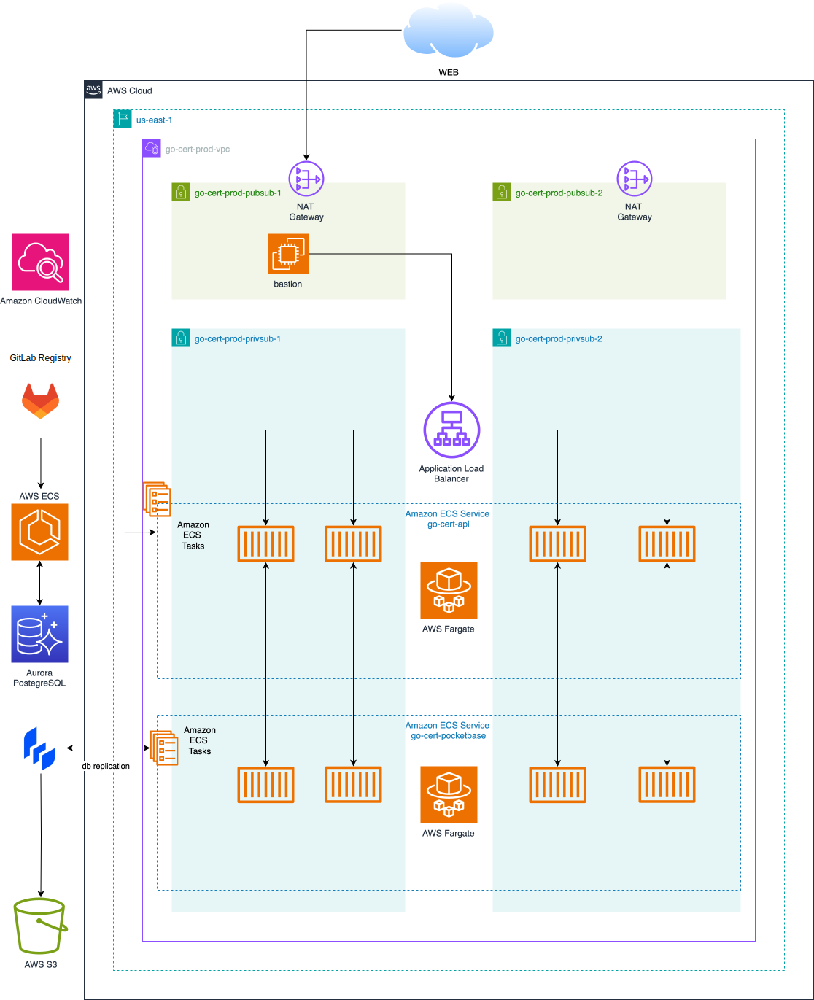


Ce projet à été réalisé dans le cadre de ma première année de Master, en collaboration avec [Matteoz](https://gitlab.com/Toxma). Je me suis tout particulièrement intéressé à la partie `DevOps` du projet, à savoir la mise en place d'une pipeline de livraison continue ainsi que la partie infrastructure as code permettant d'héberger l'applicatif.


## Introduction

Le but de cet article est de résumer la façon dont j'ai appréhendé l'intégration d'un applicatif au sein d'une infrastructure dite `cloud-native`. Ce projet couvrais le développement d'une API REST, jusqu'à son déploiement de façon continue sur un environnement AWS imposé, à savoir [AWS ECS](https://docs.aws.amazon.com/fr_fr/AmazonECS/latest/developerguide/Welcome.html). S'agissant d'un travail en groupe de deux, la répartition de la charge de travail à été établie comme ceci :

- [Matteoz](https://gitlab.com/Toxma) c'est chargé de la partie développement applicative
- Pour ma part, j'ai mis en place une usine logicielle permettant à mon collègue de déployer l'application sur une infrastructure managée par le code. La [documentation du projet](https://gocert.gitlab.io/go-cert-wiki/) est aussi industrialisée et rédigée en Markdown puis poussée par [Material for MkDocs](https://squidfunk.github.io/mkdocs-material/).

L'ensemble du code source et la documentation projet est disponible sur le [groupe GitLab du projet](https://gitlab.com/gocert).


Cet article n'as pas pour but de faire doublon avec la doc technique du projet. Il s'agit ici de résumer dans les grandes lignes la façon dont j'ai appréhendé la réalisation de ce projet


### Problématique

Comme c'est le cas dans une situation pro, le sujet fourni est une forme d'expression des besoins ayant pour finalité de répondre à une problématique. Le contexte est donc le suivant :

- Une société appelée `Solution Libre` propose des services internes et externes pour lesquels les problématiques de chiffrement sont essentiels.
- Pour répondre à ses besoins en la matière, une API de gestion de certificats doit être développée.

Les fonctionnalités attendues sont indiquées dans le sujet à savoir :

- Un CRUD permettant la gestion des droits
- La génération de certificats
- Leur gestion (CRUD)
- Leur vérification (y compris les certificats externes)

Côté tooling, certaines choses sont imposées :

- Golang pour le language de programmation
- GitLab pour l'hébergement de code source + CI/CD
- AWS ECS pour la partie hébergement
- La solution fournie doit être livrée sous forme de microservice

## Un cas DevOps concret

Une dimension essentielle de mon métier consiste à permettre à une équipe de développeurs de déployer leurs applications sans se préoccuper des processus de déploiement. Ce projet sert donc d'exemple pratique pour illustrer l'intégration d'une application au sein d'une infrastructure web.

### Compréhension des enjeux

Ma première réflexion, avant même de réfléchir d'un point de vue technique c'est de comprendre ce que je dois intégrer. Ici, il s'agit d'une API destinée à être utilisée en **interne**. L'API ne sera donc pas publique. Le développeur travaille sur ce que l'on pourrais définir comme un `backend`, réalisé en Go. Il s'appuie sur le framework [PocketBase](https://pocketbase.io/) pour la gestion de l'authentification. PocketBase embarque une base de donnée `SQLite` intégrée lui permettant de stocker les `users` et `roles`. Pour stocker les certificats générés par l'application, l'API se repose sur une base de donnée `PostgreSQL`. Il souhaiterais proposer un système de notification permettant d'avertir lorsqu'un certificat arrive à expiration. Bien sûr, je me dois de proposer un système permettant au développeur de déployer son application de façon la plus simple possible.

### Traduction des enjeux en faisabilité technique


Certaines briques techniques et choix relatifs à l'infrastructure sont imposés par le sujet. Cependant, pour garder une logique dans la rédaction de cet article, je part du principe que j'ai moi même arbitré ces choix et vais donc argumenter en ce sens.


#### Mon application est une API interne

Cette API ne doit pas être accessible publiquement. Je propose donc :

- D'héberger cette application dans un subnet privé, au sein du VPC de l'entreprise. Je met donc en place un `bastion` permettant de requêter l'API lors de la phase de débogage. L'accès à ce bastion sera restreint aux seules personnes autorisées.

#### Mon application est développée en Go

L'équipe de développement me fournit un `Dockerfile`, me permettant de construire une image qui pourra ensuite être déployée en production. Pour ce faire :

- Je crée un cluster ECS, et prépare un service permettant d'héberger l'image ainsi construite. Pour faciliter un maximum la maintenance, je me base sur une architecture serverless proposée par AWS : [Fargate](https://docs.aws.amazon.com/fr_fr/AmazonECS/latest/developerguide/AWS_Fargate.html).

#### Mon application se base sur un middleware d'authentification particulier : PocketBase

Je me documente sur la manière dont `PocketBase` fonctionne. D'un point de vue infrastructure, il faut réfléchir à la résilience des données. Premier problème :

- PocketBase ne permet pas d'utiliser une base de donnée externe, et intègre `SQLite` pour le stockage des `users` et `roles`.

Plusieurs solutions :

- Monter un volume [EFS](https://aws.amazon.com/fr/efs/) afin d'être en mesure de faire des sauvegardes

Après plusieurs recherches, utiliser `SQLite` sur un partage réseau [semble ne pas fonctionner comme voulu](https://www.sqlite.org/useovernet.html).

- Passer par une solution logicielle : [LiteStream](https://litestream.io/).

LiteStream permet tout simplement de répliquer en temps réel la base de donnée `SQLite` vers par exemple, un bucket `S3`.

#### Mon application à besoin d'une base de donnée PostgreSQL

Je propose d'utiliser une solution managée AWS : [Aurora](https://docs.aws.amazon.com/fr_fr/AmazonRDS/latest/AuroraUserGuide/Aurora.AuroraPostgreSQL.html)

#### L'équipe de développeur souhaite mettre en place un système de notification

Différents services de communication (Slack, Discord, Teams...) proposent des intégrations sous la forme de WebHooks. Dans notre cas, nous avons choisi la solution Discord pour présenter un POC. La feature que j'ai proposée est disponible [dans ce commit](https://gitlab.com/gocert/go-cert-api/-/commit/a77afa6928c83b96e09c805266e3bf029492aec9).

#### L'équipe de développeur doit être autonome dans ses déploiements

Mon infrastructure sera construite `as code`, et je fournirais des pipelines de déploiement permettant à l'équipe de déployer facilement ses versions. Le tout étant hébergé sur `GitLab`, je me baserais sur [AutoDevops](https://docs.gitlab.com/ee/topics/autodevops/) dans la mesure du possible, afin de ne pas avoir à maintenir des pipelines complexes. De plus, GitLab propose des outils pratiques permettant par exemple de [gérer les backends Terraform](https://docs.gitlab.com/ee/user/infrastructure/iac/terraform_state.html). Enfin, j'ai appris que récemment `Terraform` change de license. Je choisis d'utiliser un fork open-source pour gérer mon infrastructure : [OpenTofu](https://opentofu.org/).


Bien faire attention aux licenses des outils que l'on utilise. Bien que la majorité des outils DevOps soient open-source, cela peut être amené à changer et poser quelques problématiques lorsqu'on propose des services commerciaux basés sur ces outils.


### Schema d'architecture

La meilleure manière de poser des bases concrètes quand on parle d'architecture informatique, c'est de réaliser un schéma. Le voici :

L'ensemble du code d'infrastructure est disponible sur le [repo  GitLab du projet](https://gitlab.com/gocert/go-cert-infra).

## Spécificités liées à l'environnement du projet

Nous avons lors de la phase de réalisation allègrement dépassé la limite offerte sur les runners GitLab sur sa version `Free`. De plus, l'environnement AWS fourni par l'école comportais certaines restrictions, notamment **l'impossibilité de configurer les rôles `IAM` sur l'environnement proposé**. En quoi cela était bloquant :

- Les `tasks` ECS ne pouvais pas accéder aux différents secrets (login DB, tokens) sans assumer un rôle ayant les bonnes policies de configurées
- La solution LiteStream a besoin d'un service account afin d'être en mesure d'écrire dans le bucket S3.


L'ensemble des configurations que j'ai effectuées sont disponibles [ici](https://gitlab.com/gocert/go-cert-infra/-/tree/main?ref_type=heads).


 Pour contourner cela, j'ai utilisé mon compte Cloud Guru pour instancier des `sandboxs` non restreintes à la volée. L'utilisation de `OpenTofu` a permis cela de façon aisée, étant donné que l'ensemble de ma configuration est écrite. En outre, la `sandbox` ainsi créée m'as permis de créer une VM EC2 servant en tant que runner, nous permettant de continuer à déployer via les pipelines CI/CD.

Si tu souhaites avoir plus de détail sur l'ensemble du projet, je t'invite à lire [la documentation écrite pour l'occasion](https://gocert.gitlab.io/go-cert-wiki/).

## Conclusion

Encore une vrai mise en pratique proposée par notre formateur [ Thomas Saquet](https://www.linkedin.com/in/saquet/). La conceptualisation, création, puis déploiement d'un applicatif web de A à Z est un bon exercice pour réellement comprendre les enjeux auxquels sont confrontés un `DevOps`. En effet, il ne s'agit pas uniquement de construire une infrastructure, mais d'être en mesure de proposer les solutions les plus pertinentes pour mettre en production un applicatif client.